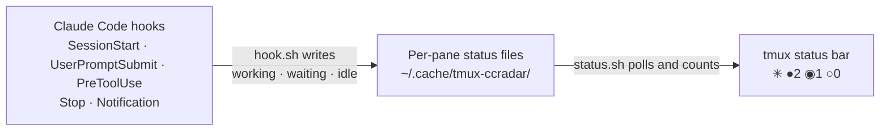

# tmux-ccradar

A minimal, zero-dependency shell plugin that shows live [Claude Code](https://docs.anthropic.com/en/docs/claude-code) activity in your tmux status bar. See at a glance how many instances are working, waiting for input, or idle across all panes.

**Default**


**Customized**


## Install

Requires [TPM](https://github.com/tmux-plugins/tpm).

Add to `~/.config/tmux/tmux.conf` (or `~/.tmux.conf`):

```tmux
set -g @plugin 'xsmyile/tmux-ccradar'
```

Then press `prefix + I` to install.

## Setup

The plugin tracks Claude Code activity via [hooks](https://docs.anthropic.com/en/docs/claude-code/hooks). Run the installer once to wire them into `~/.claude/settings.json`:

```sh
~/.config/tmux/plugins/tmux-ccradar/scripts/install-hooks.sh
```

It merges the four hook events without touching your other settings, backs up the previous file to `settings.json.bak`, and is safe to re-run (re-running an up-to-date file changes nothing). Requires [`jq`](https://jqlang.github.io/jq/). Restart any running Claude Code sessions afterwards.

<details>
<summary>Manual setup (alternative)</summary>

Add this to `~/.claude/settings.json`:

```json
{
  "hooks": {
    "SessionStart": [
      {
        "hooks": [
          {
            "type": "command",
            "command": "~/.config/tmux/plugins/tmux-ccradar/scripts/hook.sh SessionStart"
          }
        ]
      }
    ],
    "UserPromptSubmit": [
      {
        "hooks": [
          {
            "type": "command",
            "command": "~/.config/tmux/plugins/tmux-ccradar/scripts/hook.sh UserPromptSubmit"
          }
        ]
      }
    ],
    "PreToolUse": [
      {
        "hooks": [
          {
            "type": "command",
            "command": "~/.config/tmux/plugins/tmux-ccradar/scripts/hook.sh PreToolUse"
          }
        ]
      }
    ],
    "Stop": [
      {
        "hooks": [
          {
            "type": "command",
            "command": "~/.config/tmux/plugins/tmux-ccradar/scripts/hook.sh Stop"
          }
        ]
      }
    ],
    "Notification": [
      {
        "hooks": [
          {
            "type": "command",
            "command": "~/.config/tmux/plugins/tmux-ccradar/scripts/hook.sh Notification"
          }
        ]
      }
    ]
  }
}
```

</details>

## How it works



1. Claude Code fires hook events as it works
2. `hook.sh` writes `working`, `waiting`, or `idle` to a per-pane status file
3. `status.sh` counts Claude panes and their states (working/waiting/idle), renders to the status bar
4. Stale status files are cleaned up automatically when sessions close

## Status bar placement

By default the plugin appends to `status-right`. If you build your status bar manually (e.g. with catppuccin or a custom theme), use the `#{ccradar}` placeholder to control where it appears:

```tmux
set -g status-right "#{ccradar} other-stuff"
```

The plugin replaces the placeholder with the status output at load time.

## Options

All options are optional. Set them in `tmux.conf` **before** the TPM `run` line.

```tmux
# Colors (any tmux-compatible color: hex, name, or terminal color number)
set -g @ccradar-color-working "#a6da95"   # green (default)
set -g @ccradar-color-waiting "#f5a97f"   # orange (default)
set -g @ccradar-color-idle    "#eed49f"   # yellow (default)
set -g @ccradar-color-text    "#cad3f5"   # foreground (default)

# Icon shown before the status (any Unicode glyph, Nerd Font icon, emoji, or text)
set -g @ccradar-icon "✳ "   # default (plain Unicode, no Nerd Font needed)

# Key binding for the sessions overview popup (default: C)
set -g @ccradar-popup-key "C"

# Treat a "working" session as idle if its status hasn't changed in this many
# seconds (default: 1800 = 30 min; set 0 to disable)
set -g @ccradar-working-ttl "1800"
```

The default colors (green, orange, yellow, light grey) work with most themes and can be overridden to match yours.

`@ccradar-working-ttl` guards against a session that gets stuck showing `working` — for example if Claude Code exits without firing its `Stop` hook, or the hooks become misconfigured. A `working` status older than the TTL is shown as `idle`. Lower it for snappier staleness detection, or set `0` to trust the hooks completely. Only `working` is aged out; `waiting` always persists, since it means a session needs your attention.

### Refresh rate

The status updates every `status-interval` seconds. For responsive updates:

```tmux
set -g status-interval 2
```

## Sessions overview popup

Press `prefix + C` (configurable via `@ccradar-popup-key`) to open a popup window showing all active Claude Code sessions with their status and working directory.

```
  Claude Code Sessions
  ────────────────────────────────────────

  ● main:1       ~/dev/myapp           working
  ◉ api:0        ~/dev/api-server      waiting
  ○ work:2       ~/dev/tmux-plugin     idle

  3 sessions: 1 working · 1 waiting · 1 idle
```

## Requirements

- tmux 3.0+
- [Claude Code](https://docs.anthropic.com/en/docs/claude-code)
- A terminal with true color support (for hex colors)

## License

MIT
